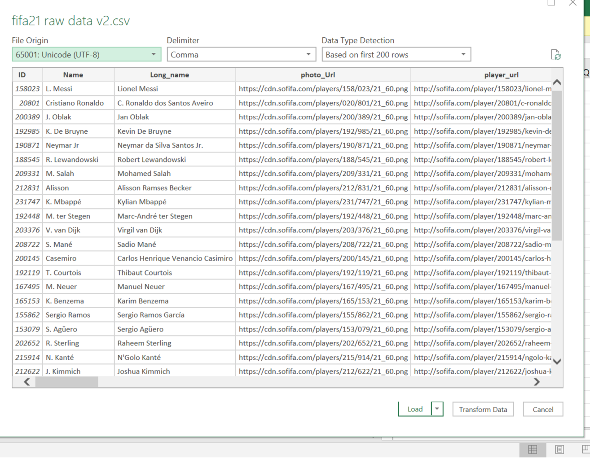

# DATA CLEANING: FIFA 2021 


## Background

I recently participated in a data cleaning challenge organized in the data-tech space, the project was aimed at transforming FIFA 2021 messy data into a clean and 
usable data that is ready for analysis.I transformed the data using M language and other data transformation tool available on Microsoft Power Query editor and 
I will be sharing my process with you in this document.

## Data Description

The raw  FIFA 21 dataset was sourced from [kaggle](https://www.kaggle.com/datasets/yagunnersya/fifa-21-messy-raw-dataset-for-cleaning-exploring),
the dataset obtained via web scrapping from sofifa.com contains two csv files namely fifa21 raw data v2.csv and fifa21_raw_data.csv the former was 
used for the sake of this project. The fifa21 raw data v2.csv file contains 18,979 rows and 77 colunms,it contains information about football players,
their capabilities and performance updated up till 2021.

## Data Cleaning Objective

The object of this data cleaning project is to improve the data quality by ensuring the data is accurate,complete,valid and consistent before the data analysis phase, and that was exactly what I did.

## Data Transformation
 As I have stated earlier I used the Microsoft power query editor to complete the cleaning task, the raw data was messy and it contained a lot of discrepancies,special characters and irrelevant data. To combat the issue I loaded the cvs file to the power query editor and began the transformation process.
 
 ## Special Characters
  After importing the data to power query editor in excel, I changed the file origin to UTF-8 encoding,this automaticaly removed the special characters and replaced 
  it with the appropriate letter.
  
   |Special character Before  | Special character After                           |                                 
  ---------------------------:|:-----------------------------------
  |                                       
  
  
  ## Name,Long_name and ID
  The dataset does not consist of duplicate data, so the next line of action was to check the data types of each column. Begining with the ID,Name and Long_name 
  columns respectively, these columns had the right data type and didn't contain inconsistent data so it was left in its original state.
  
  ## Photo_Url and Player_Url
  The photo_Url and player_Url columns contained metadata about the players which includes a link to the players picture and a link to the players website respectively.I decided to delete these columns because they would not be relevant in the analysis phase.
  
  ## OVA,POT, AND BOV
  The ova(overall analysis rating),POT(potential rating) and BOV(best overall) colunms contained numeric values and had a wrong data type, these columns ideally
  should have a percentage data type and be written as a percentage value according to the data dictionary. To transform these colunmns I divided each colunmn by 100 and changed the data type to percentage.
  
  |OVA & POT Before     | OVA & POT After                |                                 
  ---------------------:|:----------------------
  |                                       
  

  ## Contract
  The contract column had a wrong data type and contained data in 3 different formats such as '2020 ~ 2024', 'Aug 31, On Loan','Free' as seen in the image below,these inconsistencies had to be fixed. Observing the data contained in this column I decided to extract more data from the column to provide more information that might be useful in the analysis phase. I created the 'Agreement' and 'Contract Duration' columns using conditinal statements. 
  
  #### Agreement
  To populate this column i created a condidtional statement with 2 clauses and an else statement written as follows
 
  Clause 1: If (column name)Contract (operator) equals (value)Free (output)Free
  
  Clause 2: Else If (column name)Contract (operator) contains (value) Loan(output)Loan
  
  Else: Contract
  
 The agreement column provides information on the type of agreement players have with their clubs be it contract based, on a loan or free.  
  
 The next line of action was to correct the inconsistencies in the contract column, to fix this I splited the colunm by the delimiter contained in the column '~'
  creating two columns contract 1 and contract 2 which I renamed as 'contract start' and 'contract end' respectively.
  The contract start column contained some errors which I replaced with null because it represents missing values as some players do not have a contract. I then proceeded to create the duration column.
  
  #### Contract Duration
  To create this column I used a custom column using this formula '[contract end]-[contract start]' the result of this arithemetic operation populates a new column which I named 
  'Contract Duration',it contained some errors which I replaced  with 'null' this is because the errors are as a result of the rows containing 'free and loan date' which can not be subtracted, I then changed data type to the correct format. The contract duration column contains how long a players contract lasted for or should last as the case maybe.
    
  |Contract Before       | Contract,Agreement & Contract duration After                |                                 
  ----------------------:|:----------------------
  |   
  
  
  ## Height and Weight
   The height and weight column had a wrong data type and a few discrepancies the height data had two different formats '180cm' and 5'7",
   in the same vein the weight column had two different categories 100kg and 130lbs these columns had to be normalized for conistency to achieved.
   
   To change the height column into cm I broke the task down into 4 steps

   Step 1: I Created a column that multiplies 5 and 6 by 12, the logic behind this was to convert 5ft and 6ft into inches, I created a conditional statement to achieve this and named the column (multiply by 12)
   
   
   Step 2: I created a conditional statement that populates a column based on the condition that states'if [height] ends with cm output 1,else 0.393701' the logic behind this is to use this column to convert inches to cm. I named this column (convert to cm)
   
   
   Step 3: I proceeded to split the height column by the apostrophe (') delimiter, this created two columns height 1 & 2, I removed the 'cm' value and the quotation mark(")
   after which I created a new column that multiplies [height 1] * [multply by 12] which was the column created in step 1. I named this column multiplication.
   
   
   Step 4: I changed the null values in height to zero(0) after which I created a new column by creating a custom formula '[height 2] + [multplication]' which 
   is the column that was created in step 3, I named this column addition. I then proceeded to create a new column with a custom column using this formula 
   '[addition] / [convert to cm]' this column provided the final result which is each players height in (CM). To keep the data clean I deleted the 5 aforementiond columns in the preceeding steps leaving only the (Height in cm) column because its relevant to the data.


  | Height Before     | Height After        |                                 
  ---------------------:|:----------------------
  |  
  
  
   To clean the weight column I used the M language using this formula
   
      ```if Text.Contains([Weight],"kg") then
         Number.From( Text.BeforeDelimiter([Weight],"kg"))*2.205
        else Text.BeforeDelimiter([Weight],"lbs")```
        
   This transformed the weight column to a standardized format which is the players weight in lbs
   
   | Weight Before  |  Weight After           |                                 
  ---------------------:|:----------------------
  |  
  
  
   ## Value, Wage, and Release clause
   These columns have similar inconsistencies the prefix '€' stands for euros, the suffix 'M' and 'K' represntents million and thousand respectively to standardize the data 
   I removed the '€' suffix from the 3 column, coverted the numbers to dollars  using the following M language formula
    
   #### Value
      ```(if Text.Contains([Value],"M") then
          Number.From( Text.BeforeDelimiter([Value],"M"))*1000000 else
          Number.From( Text.BeforeDelimiter([Value],"K"))*1000) *1.07```

   #### Wages
    ```(if Text.Contains([Wage],"K") then
       Number.From( Text.BeforeDelimiter([Wage],"K"))*1000
       else Number.From([Wage]))*1.07```

   #### Release Clause
       ```(if Text.Contains([Release Clause],"M") then
          Number.From ( Text.BeforeDelimiter([Release Clause],"M"))*1000000
          else Number.From (Text.BeforeDelimiter([Release Clause],"K"))*1000)*1.07```

After this I changed the data type to the accurate data type.

|Value,Wages & Release clause Before | Value,Wages & Release clause After                |                                 
  ---------------------:|:----------------------
  |  


 ## IR,SM AND W/F
  These columns had the star symbol (★) which respresents ratings and a text data type I removed the symbol and changed it to a numeric data type
  
  |IR,SM AND W/F Before | IR,SM AND W/F After                |                                 
  ---------------------:|:----------------------
  |  
 
  
  ## Hits
  This column contained data points that had the letter 'K' which represents thousand I used this M language formula to normalise the data and changed the data 
  type to a numeric format.
  
   (if Text.Contains([Hits],"K") then
      Number.From( Text.BeforeDelimiter([Hits],"K"))*1000 else
      Number.From( [Hits])
      
  | Hits Before               |  Hits After                |                                 
  ---------------------:|:----------------------
  |  
 
 ## CONCLUSION
 
 The FIFA 2021 raw dataset was very messy, the data cleaning process was daunting intially but it eventually became interesting.The dataset has be normalised and transformed and it is ready for analysis. Joining the data cleaning challenge was a nice learning curve for me, I am looking foward to the data analysis and visualization part of this project.
 Thank you for reading, your feedback and recommendations are highly welcomed. Feel free to connect with me on [Linkedin](www.linkedin.com/in/ogunjimi-bukola) and [Twitter](https://twitter.com/Oluwabukola0).


